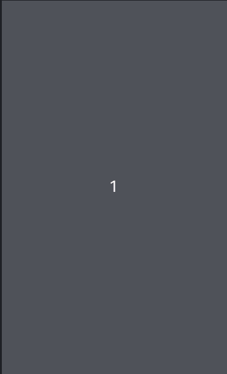

# Simple Coroutine Timer

## Installation

- Maven Repository : 추가될 예정

- 기타: WaveView.kt, CorocUtil.kt,CorocWaveDrawable.kt, WaveDrawable.java파일만 빼가서 포함시키면 됨.

## Color Progress

- 단순하게 화면을 채우는 타이머, 아마 쓰지는 않을 예정

## Wave Progress

- 데모



- 물결 모양으로 화면을 채우는 타이머

- 설명서
  - 예시  
  ```kotlin
  val waveTimerView = WaveTimerView(this, waveRoot, 33, 60)
  waveTimerView.setWaveDrawable(R.drawable.gradient_red_salvation, Color.argb(100,255,255,255), PorterDuff.Mode.SCREEN)      
  ```
   WaveTimerView 생성 후 setWaveDrawable을 해야 사용할 수 있음. 
   
   ```kotlin
   waveTimerView.toggleTimer()
   ```
   
   toggleTimer를 통해서 타이머를 껏다 켰다 할 수 있음. 
   
   - Method specification
   
   WaveView.kt
   
   ```kotlin
   fun setWaveDrawable(colorRes: Int) : CorocWaveDrawable?
   fun setWaveDrawable(colorRes: Int, bgColorFilter: Int, filterMode: PorterDuff.Mode = PorterDuff.Mode.SRC) : CorocWaveDrawable?
   fun toggleTimer()
   fun restartTimer() // 작동 여부 검증 아직 안 되었음. 
   ```
   CorocWaveDrawable.kt
   
   ```kotlin
   constructor(drawable: Drawable?) : super(drawable)
   constructor(context: Context, imgRes: Int) : super(context, imgRes)
   constructor(context: Context, imgRes: Int, bgColorFilter: Int, filterMode: PorterDuff.Mode): super(context, imgRes)
   ```
   
   WaveDrawable.java
   
   [Original Code](https://github.com/race604/WaveLoading)
   
