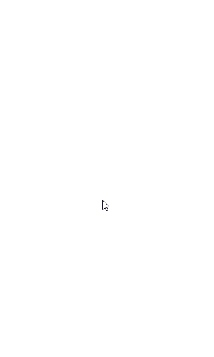

# 간단한 코루틴 타이머

대학교 팀프로젝트에 쓰기 위한 모듈로서 작성중입니다.

## ColorProgress

- 시간초에 따라서 이미지뷰를 크롭하는 타이머

## WaveProgress

- 시간초에 따라서 이미지뷰를 움직이는 사인곡선 형태로 크롭하는 타이머

# TodoList

- WaveDrawable에서 Match_Parent가 잘 작동하지 않는 것 수정
- 다른 프로젝트에서 쓰기 쉽도록 모듈화 할 것 
- 자바 프로젝트와 호환이 쉽도록 해볼 것 
- ColorFilter를 직접 입력하지 않고 Color.Filter를 통해서 RGB값으로 편하게 입력할 수 있게할 것 
- SectorProgressView를 사용해서 타이머를 만들어 볼 것 
