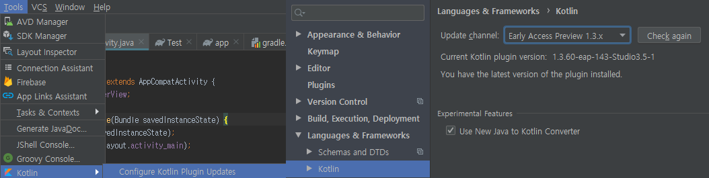

# Simple Coroutine Timer

## 설치

- 클론으로 다운받아서 직접 코드를 사용

```git
git clone https://github.com/Simhyeon/simple_coroutine_timer
```

- [WaveTimerView.jar](https://github.com/Simhyeon/simple_coroutine_timer/blob/master/WaveTimerView.jar) 를 다운 받아서 사용 (ColorProgress.kt는 미 포함)

- **라이브러리 사용 환경**

  - 코틀린 버전 1.3.x으로 설정

  

  - build.gradle (Proejct)

  ```gradle
  buildscript {
    ext.kotlin_version = '1.3.50'
    //...

    dependencies {
        //...
        classpath "org.jetbrains.kotlin:kotlin-gradle-plugin:$kotlin_version"
        //...
    }
  }

  ```

  - build.gradle (Module)

  ```gradle
  apply plugin: 'com.android.application'
  apply plugin: 'kotlin-android'

    dependencies {
        //...
        implementation "org.jetbrains.kotlin:kotlin-stdlib:$kotlinVersion"
        implementation 'org.jetbrains.kotlinx:kotlinx-coroutines-core:1.2.1'
        implementation 'org.jetbrains.kotlinx:kotlinx-coroutines-android:1.1.1'
        //...
    }

  ```

## Color Progress Timer

- 단순하게 화면을 채우는 타이머, 아마 쓰지는 않을 예정

## Wave Timer View

- 물결 모양으로 화면을 채우는 타이머

- 데모


- 예시 (코틀린, 자바)

  - 코틀린

  ```kotlin
    var waveTimerView: WaveTimerView? = null
    override fun onCreate(savedInstanceState: Bundle?) {
        super.onCreate(savedInstanceState)
        this.requestWindowFeature(Window.FEATURE_NO_TITLE)
        this.window.setFlags(WindowManager.LayoutParams.FLAG_FULLSCREEN, WindowManager.LayoutParams.FLAG_FULLSCREEN)
        setContentView(R.layout.wave_progress)

        waveTimerView = WaveTimerView(this, waveRoot, 33, 120)
        waveTimerView!!.setWaveDrawable(R.drawable.gradient_red_salvation, Color.argb(100,255,255,255), PorterDuff.Mode.SCREEN)
        //waveTimerView.setWaveDrawable(R.drawable.gradient_morpheus_den, Color.argb(0,255,255,255), PorterDuff.Mode.SRC)
        waveTimerView!!.requestLayout()

        waveTimerView!!.setOnClickListener {
            Toast.makeText(this, "Toggled", Toast.LENGTH_SHORT).show()
            waveTimerView!!.toggleTimer()
        }
    }

    override fun onPause() {
        super.onPause()
        waveTimerView!!.endTimer()
    }
    // 코틀린 코루틴을 통해서 구현했기 때문에 액티비티가 변경되도 메서드는 계속 호출되고 있으므로 인위적으로 endTimer()를 호출해줘야 함.
  ```

  - 자바

  ```java
    WaveTimerView waveTimerView;
    @Override
    protected void onCreate(Bundle savedInstanceState) {
        super.onCreate(savedInstanceState);
        
        // 원한다면 이 부분에 statusbar를 지우는 코드를 넣어도 됨. 그리고 넣는게 더 이뻐보임.
        
        setContentView(R.layout.activity_main);

        ViewGroup rootView = findViewById(R.id.rootView);
        waveTimerView = new WaveTimerView(this, rootView, 33, 60);
        waveTimerView.setWaveDrawable(R.color.colorAccent, Color.argb(100, 255, 255, 255), PorterDuff.Mode.SCREEN);

        rootView.setOnClickListener(new View.OnClickListener() {
            @Override
            public void onClick(View v) {
                waveTimerView.toggleTimer();
            }
        });
    }

    @Override
    protected void onPause() {
        super.onPause();
        waveTimerView.endTimer();
    }
    // 코틀린 코루틴을 통해서 구현했기 때문에 액티비티가 변경되도 메서드는 계속 호출되고 있으므로 인위적으로 endTimer()를 호출해줘야 함.
  ```

- 메서드 스펙

  - WaveTimerView.kt

   ```kotlin
   WaveTimerView(context: Context, rootViewGroup: ViewGroup, var delayMilliSeconds: Int, var durationS: Int) : ImageView(context)
   // WaveTimerView의 생성자 - 컨텍스트, 뷰를 추가할 부모 뷰그룹, 이미지의 레벨(높이) 상승 간격, 타이머 총시간(초) 
   fun setWaveDrawable(colorRes: Int) : CorocWaveDrawable?
   // WaveTimerView에 drawable 오브젝트를 할당하는 메서드 기본적으로는 색을 전달한다. gradient Color도 가능
   fun setWaveDrawable(colorRes: Int, bgColorFilter: Int, filterMode: PorterDuff.Mode = PorterDuff.Mode.SRC) : CorocWaveDrawable?
   // 배경의 컬러필터도 임의로 할당한다.
   fun toggleTimer() 
   fun endTimer() 
   fun restartTimer() 
   ```

- 샘플 그라디언트 파일

  [Resources](https://github.com/Simhyeon/simple_coroutine_timer/tree/master/app/src/main/res/drawable)
