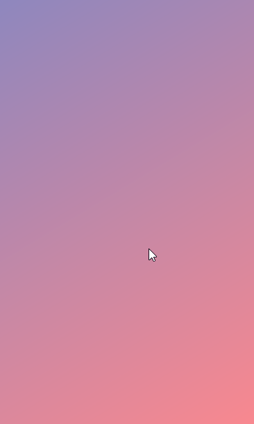

# Simple Coroutine Timer

## 설치

```git
git clone https://github.com/Simhyeon/simple_coroutine_timer
```

- **코드 사용 환경**

  - 코틀린 버전 1.3.x으로 설정

  

  - build.gradle (Proejct)

  ```gradle
  buildscript {
    ext.kotlin_version = '1.3.50'
    //...

    dependencies {
        //...
        classpath "org.jetbrains.kotlin:kotlin-gradle-plugin:$kotlin_version"
        //...
    }
  }

  ```

  - build.gradle (Module)

  ```gradle
  apply plugin: 'com.android.application'
  apply plugin: 'kotlin-android'

    dependencies {
        //...
        implementation "org.jetbrains.kotlin:kotlin-stdlib:$kotlin_version"
        implementation 'org.jetbrains.kotlinx:kotlinx-coroutines-core:1.2.1'
        implementation 'org.jetbrains.kotlinx:kotlinx-coroutines-android:1.1.1'
        //...
    }

  ```

## Color Progress Timer

- 단순하게 화면을 채우는 타이머 clipDrawable로 

## Running Timer View (어도비 라이센스로 벡터 파일 공유 x) 

- 움직이는 벡터 애니메이션과 디지털 시계 폰트로 구성된 시간을 보여주는 타이머, 남은 시간의 비율에 따라 색이 변경됨

- [Font](https://www.dafont.com/alarm-clock.font) /// [Font Family File](https://github.com/Simhyeon/simple_coroutine_timer/blob/master/app/src/main/res/font/alarmclock.xml)

- 데모

  

- 예시 (코틀린, 자바)

  - 코틀린
  
  ```kotlin
  //...
  private val givenTime: Int = 30
  lateinit var runningTimerView: RunningTimerView
  // 순차적으로 순환할 리소스(정수) 배열
  private val imageArray : Array<Int> = arrayOf( // 벡터 파일은 제공되지 않음.
      R.drawable.ic_running_horse_1.xml, R.drawable.ic_running_horse_2.xml, R.drawable.ic_running_horse_3.xml, 
      R.drawable.ic_running_horse_4.xml, R.drawable.ic_running_horse_5.xml, R.drawable.ic_running_horse_6.xml, 
      R.drawable.ic_running_horse_7.xml, R.drawable.ic_running_horse_8.xml, R.drawable.ic_running_horse_9.xml, 
      R.drawable.ic_running_horse_10.xml, R.drawable.ic_running_horse_11.xml, R.drawable.ic_running_horse_12.xml
  )

  override fun onCreate(savedInstance : Bundle?) {
      //...

      timerText.text = CorocUtil.timeToMSFormat(givenTime)
      runningTimerView = RunningTimerView(
          this, runningView, imageNumber, imageArray, 150, givenTime, R.color.neonGreen, R.color.neonRed
      )

      changeImage.setOnClickListener {
          Toast.makeText(this, "Toggled", Toast.LENGTH_SHORT).show()
          runningTimerView.toggleTimer()
      }
  }
  ```
  
  - 자바
  
  ```Java
  //...
  Integer givenTime = 30;
  RunningTimerView runningTimerView;
  // 순차적으로 순환할 리소스(정수) 배열
  Integer[] imageArray = { // 벡터 파일은 제공되지 않음.
        R.drawable.ic_running_horse_1.xml, R.drawable.ic_running_horse_2.xml, R.drawable.ic_running_horse_3.xml, 
        R.drawable.ic_running_horse_4.xml, R.drawable.ic_running_horse_5.xml, R.drawable.ic_running_horse_6.xml, 
        R.drawable.ic_running_horse_7.xml, R.drawable.ic_running_horse_8.xml, R.drawable.ic_running_horse_9.xml, 
        R.drawable.ic_running_horse_10.xml, R.drawable.ic_running_horse_11.xml, R.drawable.ic_running_horse_12.xml
  };

  @Override
  public void onCreate(Bundle savedInstanceState) {
      //...

      TextView imageNumber = findViewById(R.id.imageNumber);
      ImageView runningView = findViewById(R.id.runningView);
      Button changeButton = findViewById(R.id.changeImage);
      imageNumber.setText(CorocUtil.Companion.timeToMSFormat(givenTime));
      final RunningTimerView runningTimerView = new RunningTimerView(
          this, runningView, imageNumber, imageArray, 150, givenTime, R.color.neonGreen, R.color.neonRed
      );

      changeButton.setOnClickListener(new View.OnClickListener() {
          @Override
          public void onClick(View v) {
              Toast.makeText(getApplicationContext(), "Toggled", Toast.LENGTH_SHORT).show();
              runningTimerView.toggleTimer();
          }
      });
  }
  ```
  
  -메서드 스펙
  
  ```kotlin
  RunningTimerView(val context: Context,val runningView: ImageView,val timerView: TextView, val imageArray : Array<Int>, var animationDelay: Int, val durationS: Int ,val startColorRes : Int, val endColorRes: Int) // 생성자
  // 순서대로: 컨텍스트, 벡터 이미지 뷰, 타이머텍스트 뷰, 이미지 배열, 애니메이션딜레이, 타이머 총시간(초), 시작 색상, 종료 색상
  fun toggleTimer()
  fun endTimer()
  fun restartTimer()
  ```
  
## Wave Timer View

- 물결 모양으로 화면을 채우는 타이머

- 데모



- 예시 (코틀린, 자바)

  - 코틀린

  ```kotlin
  //...
  var waveTimerView: WaveTimerView? = null
  override fun onCreate(savedInstanceState: Bundle?) {
      super.onCreate(savedInstanceState)
      this.requestWindowFeature(Window.FEATURE_NO_TITLE)
      this.window.setFlags(WindowManager.LayoutParams.FLAG_FULLSCREEN, WindowManager.LayoutParams.FLAG_FULLSCREEN)
      setContentView(R.layout.wave_progress)

      waveTimerView = WaveTimerView(this, waveView, 33, 120)
      waveTimerView!!.setWaveDrawable(R.drawable.gradient_red_salvation, Color.argb(100,255,255,255), PorterDuff.Mode.SCREEN)
      //waveTimerView.setWaveDrawable(R.drawable.gradient_morpheus_den, Color.argb(0,255,255,255), PorterDuff.Mode.SRC)

      waveTimerView!!.setOnClickListener {
          Toast.makeText(this, "Toggled", Toast.LENGTH_SHORT).show()
          waveTimerView!!.toggleTimer()
      }
  }

  override fun onPause() {
      super.onPause()
      if (waveTimerView != null) {
            waveTimerView!!.endTimer()
      }
  }
  // 코틀린 코루틴을 통해서 구현했기 때문에 액티비티가 변경되도 메서드는 계속 호출되고 있으므로 인위적으로 endTimer()를 호출해줘야 함.
  ```

  - 자바

  ```java
  //...
  WaveTimerView waveTimerView;
  @Override
  protected void onCreate(Bundle savedInstanceState) {
      super.onCreate(savedInstanceState);

      // 원한다면 이 부분에 statusbar를 지우는 코드를 넣어도 됨. 그리고 넣는게 더 이뻐보임.

      setContentView(R.layout.activity_main);

      ImageView waveView = findViewById(R.id.waveView);
      waveTimerView = new WaveTimerView(this, waveView, 33, 60);
      waveTimerView.setWaveDrawable(R.color.colorAccent, Color.argb(100, 255, 255, 255), PorterDuff.Mode.SCREEN);

      rootView.setOnClickListener(new View.OnClickListener() {
          @Override
          public void onClick(View v) {
              waveTimerView.toggleTimer();
          }
      });
  }

  @Override
  protected void onPause() {
      super.onPause();
      if (waveTimerView != null) {
            waveTimerView.endTimer();
      }
  }
  // 코틀린 코루틴을 통해서 구현했기 때문에 액티비티가 변경되도 메서드는 계속 호출되고 있으므로 인위적으로 endTimer()를 호출해줘야 함.
  ```

- 메서드 스펙

  - WaveTimerView.kt

   ```kotlin
   WaveTimerView(context: Context, imageView: ImageView, var delayMilliSeconds: Int, var durationS: Int) : ImageView(context)
   // WaveTimerView의 생성자 - 컨텍스트, drawable을 할당할 이미지뷰, 이미지의 레벨(높이) 상승 간격, 타이머 총시간(초) 
   fun setWaveDrawable(colorRes: Int) : CorocWaveDrawable?
   // WaveTimerView에 drawable 오브젝트를 할당하는 메서드 기본적으로는 색을 전달한다. gradient Color도 가능
   fun setWaveDrawable(colorRes: Int, bgColorFilter: Int, filterMode: PorterDuff.Mode = PorterDuff.Mode.SRC) : CorocWaveDrawable?
   // 배경의 컬러필터도 임의로 할당한다.
   fun toggleTimer() 
   fun endTimer() 
   fun restartTimer() 
   ```

- 샘플 그라디언트 파일

  [Resources](https://github.com/Simhyeon/simple_coroutine_timer/tree/master/app/src/main/res/drawable)
